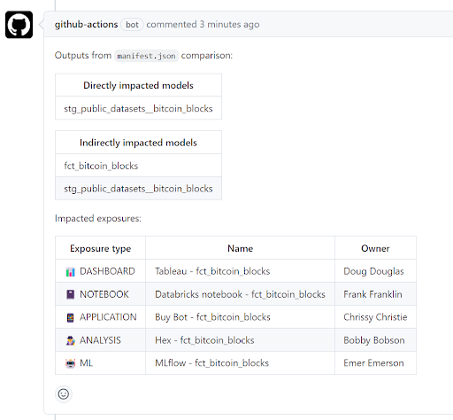
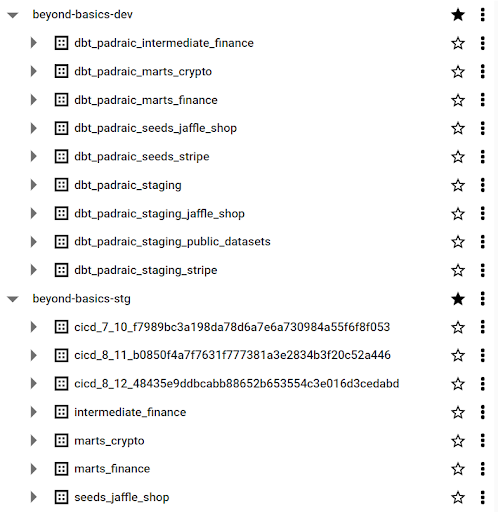

# dbt-beyond-the-basics

A repository demonstrating advanced use cases of dbt in the following areas:

- [Continuous Integration (CI)](#continuous-integration)

    - [Pre-commit](#pre-commit)
    - [dbt Artifacts and Pytest](#dbt-artifacts-and-pytest)
    - [dbt commands](#dbt-commands)
    - [Using `state:modified`](#using-statemodified)
    - [Mart Monitor](#mart-monitor)

- [Continuous Deployment (CD)](#continuous-deployment)

- [Dev Containers](#dev-containers)

- [Others](#others)

See something incorrect, open an [issue](https://github.com/pgoslatara/dbt-beyond-the-basics/issues/new)!

Want to see something else included, open an [issue](https://github.com/pgoslatara/dbt-beyond-the-basics/issues/new) 😉!

# Continuous Integration

Continuous Integration (CI) is the process of codifying standards, these range from formatting of file contents to validating the correctness of generated data in a data warehouse.

## Pre-commit

[Pre-commit](https://pre-commit.com/) provides a standardised process to run CI before committing to your local branch. This has several benefits, primarily providing the developer with a quick feedback loop on their work as well as ensuring changes that do not align with standards are automatically identified before being merged. Pre-commit operates via hooks, all of these hooks are sepecified in a `.pre-commit-config.yaml`file. There are several hooks that are relevant to a dbt project:

- [Pre-commit](https://github.com/pre-commit/pre-commit-hooks) itself provides several standard hooks that ensure standard behaviour regarding whitespace control, valid YAML files, no presence of private keys and no unresolved merge conflicts. An interesting hook is `no-commit-to-branch`, this allows the name of the git branch to be standarised, for example to always start with `feature/` or to always include a Jira ticket ID to help with tracking of work items.

    ```yaml
    # .pre-commit-config.yaml
    - repo: https://github.com/pre-commit/pre-commit-hooks
        rev: v4.4.0
        hooks:
        - id: trailing-whitespace
        - id: check-merge-conflict
        - id: check-yaml
            args: [--unsafe]
        - id: no-commit-to-branch
            name: JIRA ticket ID in branch
            args: ['--pattern', '^((?![A-Z]+[-][0-9]+[-][\S]+).)*$']
    ```

- [sqlfmt](https://github.com/tconbeer/sqlfmt) is the SQL formatter used in the dbt Cloud IDE. It is an opinionated formatter with minimal configuration options making it super easy to setup. It forces all `.sql` files to a standard SQL format thereby reducing the strain on repo readers by having a single, standard format across the repo. An alternative is [SQLFluff](https://docs.sqlfluff.com/en/stable/production.html#using-pre-commit), which also has pre-commit hooks.

    ```yaml
    # .pre-commit-config.yaml
    - repo: https://github.com/tconbeer/sqlfmt
        rev: v0.18.1
        hooks:
        - id: sqlfmt
    ```

- [dbt-checkpoint](https://github.com/dbt-checkpoint/dbt-checkpoint) is an awesome pre-commit package with multiple well-documented hooks. Some valuable options include ensuring that every model has a description in a YAML file, naming conventions for models in certain folders and that models have a minimum number of tests.

    ```yaml
    # .pre-commit-config.yaml
    - repo: https://github.com/dbt-checkpoint/dbt-checkpoint
        rev: v1.1.0
        hooks:
        - id: dbt-compile
        - id: dbt-docs-generate
        - id: check-model-has-properties-file
            name: Check that all models are listed in a YAML file
        - id: check-model-name-contract
            args: [--pattern, "(base_|stg_).*"]
            files: models/staging/
    ```

## dbt Artifacts and Pytest

dbt produces 4 artifacts in the form of JSON files:

- `catalog.json` is produced by `dbt docs generate` and contains all the information displayed in the docs web UI (primarily model schemas and data types).
- `manifest.json` is produced by `dbt compile` and is the main source of information for the project including details on all nodes, the dependencies between these nodes as well as both the raw and compiled SQL that will be run.
- `run_results.json` is produced by any dbt command that runs a node, e.g. `dbt build`, `dbt run`, etc. It contains data on the success of each node, the duration of each node and any data returned by the warehouse (adapter responses).
- `sources.json` is produced by `dbt source freshness`, similar to `run_results.json` it contains data on how long each freshness check takes as well as the success or failure of the check.

All artifacts are saved in the `./target` directory by default.

These JSON files provide a valuable resource when it comes to understanding our dbt project and codifying standards. To run tests on these these files we use [pytest](https://docs.pytest.org/en/7.3.x/), a python based testing framework:

- Create a fixture for each artifact:

    ```python
    # ./tests/pytest/conftest.py
    @pytest.fixture(scope="module")
    def catalog_json() -> dict:
        with Path("./target/catalog.json").open() as f:
            data = json.load(f)
        return data
    ```

- Write a pytest that takes a fixture as an input parameter and runs as `assert` statement:

    ```python
    # ./tests/pytest/test_columns.py
    @pytest.mark.catalog_json
    def test_column_names_models(catalog_json: dict) -> None:

        regex_pattern = "[a-z_0-9]*"

        for k, v in catalog_json["nodes"].items():
            for col in v["columns"].keys():
                if col.find(".") <= 0:
                    assert (
                        col == re.compile(regex_pattern).match(col)[0]
                    ), f"Column '{col}' in {k} does not align with the existing naming convention ({regex_pattern})."
    ```

    Using the `@pytest.mark` decorator and creating a `pytest.ini` file allow us to use marks to group pytests, for example grouping all pytests that use the `catalog.json` artifact.

The most valuable artifacts for this are `catalog.json` and `manifest.json`. Example tests include:

- A naming convention for columns, e.g. no uppercase characters.
- Each source can only be read by one staging model.
- All columns with a data type of DATE have to end with "_date".
- The `./model/staging` directory can only have 1 layer of subdirectories.
- Etc.

These tests can (and should) be run in the CI pipeline:

```yaml
# ./.github/workflows/ci_pipeline.yml
- run: pytest ./tests/pytest -m no_deps
```

They can also be run as a pre-commit hook:

```yaml
# .pre-commit-config.yaml
- repo: local
    hooks:
    - id: pytest-catalog-json
        name: pytest-catalog-json
        entry: pytest ./tests/pytest -m catalog_json
        language: system
        pass_filenames: false
        always_run: true
```

## dbt commands

Any CI pipeline should run several dbt commands:

- `dbt build`: This runs and tests all the models, ideally in a dedicated schema (set up via the `generate_schema_name` macro).
- `dbt build --select config.materialized:incremental`: This runs and tests all incremental models, this is an important step to ensure any incremental logic does not generate invalid SQL.
- `dbt source freshness`: This tests the freshness of all sources. The output of this command should be forced to success (via `|| true`) as we are not interested in whether our sources are fresh, we are interested in the generated `source.json` artifact. See `./test/pytest/test_sources.py` for an example of how to identify invalid freshness checks.

All `build` commands should make use of the following flags:

- `--warn-error`: Any warning results in a failure. This ensures no warnings enter our production branch as these have a higher likelihood to result in failures in the future or be an unintended consequence of the changes in the PR.
- `--fail-fast`: Any failed node results in the immediate failure of the command. This provides faster feedback to the developer who is waiting on the results of the CI pipeline.

An example `dbt build` command as part of the CI pipeline:

```yaml
# ./.github/workflows/ci_pipeline.yml
- run: dbt --warn-error build --fail-fast
```

## Using `state:modified`

As part of the CI pipeline the `manifest.json` artifact is generated for the feature branch, this can be compared to the `manifest.json` of the target branch using the [state](https://docs.getdbt.com/reference/node-selection/methods#the-state-method) method to identify any nodes that have been modified. In addition, the use of the `state:modified+` flag allows all downstream nodes to also be identified. When combined with exposures and comments in the PR this can help reviewers quickly assess the potential impact of a PR.



## Mart Monitor

A popular approach to CI for dbt is running [Slim CI](https://docs.getdbt.com/docs/deploy/cloud-ci-job#configuring-a-slim-ci-job), this runs the modified nodes and all downstream nodes. This has the benefit of only testing modified nodes and therefore reducing run times and operational costs.

In certain setups it may be desireable to run the entire dbt project in every CI pipeline run. While this sounds extreme there are several methods that can be used to retain the benefits of Slim CI while benefiting from other advantages, namely the ability to provide comprehensive feedback on the impact of a PR on mart models. This can be performed via several steps:

- Add or edit the `generate_schema_name` macro to force all models to be built in a single schema when the `DBT_CICD_RUN` environment variable is `true`.

    ```sql
    # ./macros/generate_schema_name.sql
    

         {{ env_var('DBT_DATASET') }}

        

            {{ node.config.schema }}

         {{ default__generate_schema_name(custom_schema_name, node) }}

        

    

    ```

    This results in a scenario where each CI pipeline run has a dedicated dataset:

    

- For staging models with large volumes of historical data there is no need to process all this data in every CI pipeline run. A jinja "if" condition can be utilised to only use a reasonble volume of data during CI runs:

    ```sql
    # ./models/staging/public_datasets/stg_public_datasets__bitcoin_blocks.sql
    

        and timestamp_month >= date_trunc(date_sub(current_date(), interval 1 month), month)

    
    ```

- In `.github/workflows/ci_pipeline`, set the required environment variables:

    - Set `DBT_CICD_RUN` to `true`.

    - Assemble the value of `DBT_DATASET` to contain the PR number, run number and sha of the latest commit. This ensures that every run of the pipeline will have a unique schema.

- Add a query to `./scripts/mart_monitor_queries.yml` that returns a single row of values. This query can test any model and contain any logic however it is best to start with examing high level summaries of mart models as these are the most critical models in a dbt project.
- In the CI pipeline (`.github/workflows/ci_pipeline`) run `dbt build` and run the `./scripts/mart_monitor_commenter.py` script passing the required arguments.
- For each mart monitor query a comment will be left in the PR to help developers and reviewers quickly assess the impact of the changes on mart models:

.](./images/mart-monitor-red.png)

.](./images/mart-monitor-green.png)

A downside of building all models in a CI pipeline is increased run time and resource consumption. This can be restricted via pytests based on the `run_results.json` artifact. See `./tests/pytest/run_results.py` for examples of how the duration and resource consumption of `dbt build` in the CI pipeline can be set to have reasonable allowable values. This provides a number of benefits:

- Poor JOIN logic that takes excessive time to compute will be identified.
- Incorrect or non-use of partitioning to select source data will result in failed CI pipelines.
- As a project grows there is continuous focus on the efficiency of CI runs resulting in a developer mindset that places efficiency higher in the priority list.


# Continuous Deployment

TODO

# Dev Containers

TODO

# Others

## Running dbt from python

In version 1.5, dbt introduced [programmatic invocations](https://docs.getdbt.com/reference/programmatic-invocations), a way of calling dbt commands natively from python including the ability to retrieve returned data. Previous ways of doing this mostly relied on opening a new shell process and calling the dbt CLI, this wasn't ideal for a lot of reasons including security. This repo further abstracts programmatic invocations to a dedicated helper function, see `run_dbt_command` in `./scripts/utils.py`.

## Conferences

This repository accompanies some conference talks:
- [NL dbt meetup: 2nd Edition](https://www.meetup.com/amsterdam-dbt-meetup/events/293640417/): "CI for dbt: Beyond the basics!", slides available [here](https://docs.google.com/presentation/d/1Y5fx4h97IY0wpsutt92nPLO1UDUcrq6YdVKt-UuL93c/edit#slide=id.p).
- [MDSFest](https://www.linkedin.com/events/7091868349487353856/): "CI for dbt: Beyond the basics!", slides available [here](https://docs.google.com/presentation/d/1M0475jIX41uxT-nLPWlymUkstuUzkq-LppZqT_o759Q/edit#slide=id.g260e469f8e9_0_7), video available [here](https://www.youtube.com/watch?v=bRKk6F07G58).
